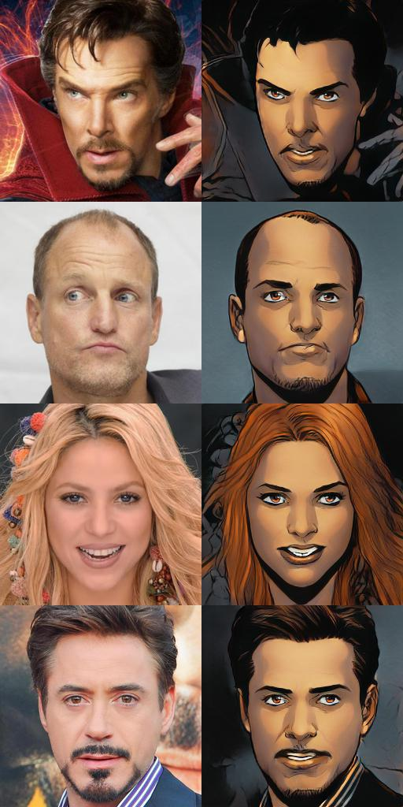

# Real to Comic Photo

Turn a real face photo into a comic-style portrait, or a comic face back into a photo, with a
**CycleGAN** trained on the Face2Comics dataset. The project includes a **Streamlit** web app, a training
CLI and a notebook that walks through the modelling.



*Dataset samples (Face2Comics v2 by Sxela).*

## Features

- **Streamlit app**: upload an image, take one with your camera, or pick a random dataset example. You
  can choose the direction (Photo → Comic / Comic → Photo) and the output size, then download the result as PNG.
- **Training CLI** (`python -m comicgan.train`): every hyperparameter is a flag. It saves preview images,
  checkpoints and a loss log.
- **Modern stack**: TensorFlow 2.18+ / Keras 3 with no `tensorflow-addons`. Saved `.keras` models load
  without `custom_objects`.
- **Tests** for the model, the data pipeline and inference (`pytest`).

## Project structure

```
real-to-comic-photo/
├── app.py                  # Streamlit app
├── comicgan/
│   ├── config.py           # paths + TrainConfig (hyperparameters)
│   ├── data.py             # tf.data pipeline (unpaired, jitter, normalization)
│   ├── model.py            # ResNet generator + PatchGAN discriminator
│   ├── losses.py           # adversarial, cycle and identity losses
│   ├── cyclegan.py         # CycleGAN training wrapper (custom train_step)
│   ├── train.py            # training CLI + callbacks
│   └── inference.py        # model loading and pre/post-processing
├── tests/                  # pytest
├── models/                 # photo2comic.keras & comic2photo.keras end up here
├── modelling.ipynb         # modelling walkthrough notebook
├── comic-faces-paired-synthetic-v2/   # dataset
├── requirements.txt        # runtime dependencies (app + training)
└── requirements-dev.txt    # + pytest, matplotlib, jupyter
```

## Installation

You need **Python 3.10–3.13** (TensorFlow 2.18+; Python 3.13 needs TensorFlow 2.20+, which pip picks automatically).

```bash
python -m venv .venv
# Windows
.venv\Scripts\activate
# macOS / Linux
source .venv/bin/activate

pip install -r requirements.txt        # app + training
pip install -r requirements-dev.txt    # if you also want tests and the notebook
```

## Dataset

This project uses [Comic faces paired synthetic v2](https://www.kaggle.com/datasets/defileroff/comic-faces-paired-synthetic-v2)
(Face2Comics v2.0.0 by Sxela): 10,000 face photos and 10,000 comic versions, 1024×1024 JPG.
The dataset is already in the repo:

```
comic-faces-paired-synthetic-v2/face2comics_v2.0.0_by_Sxela/face2comics_v2.0.0_by_Sxela/
├── faces/    # domain "photo"
└── comics/   # domain "comic"
```

To use a different location, pass `--data-dir path/to/folder`. The folder must contain `faces/` and
`comics/`. Please follow the license and attribution on the dataset's Kaggle page.

## Training

The model weights are not in the repo, so train a model first:

```bash
# Full training (defaults match the original experiment: 128 px, batch 16, 50 epochs)
python -m comicgan.train

# Quick smoke run to check that everything works (a few minutes on CPU)
python -m comicgan.train --epochs 1 --limit 64 --batch-size 4
```

Useful flags (see the full list with `python -m comicgan.train --help`):

| Flag | Default | Description |
|---|---|---|
| `--epochs` | 50 | number of epochs |
| `--batch-size` | 16 | batch size |
| `--image-size` / `--load-size` | 128 / 142 | resize to `load-size`, then random-crop to `image-size` |
| `--transformer-blocks` | 6 | residual blocks in the generator |
| `--gen-lr` / `--disc-lr` | 1e-4 / 4e-4 | Adam learning rates (β₁ = 0.5) |
| `--lambda-cycle` | 10 | cycle-consistency loss weight |
| `--limit` | – | use only the first N images per domain |
| `--steps-per-epoch` | auto | defaults to `min(#photo, #comic) // batch_size` |
| `--no-cache` | – | don't cache images in RAM (the cache needs about 1.2 GB) |
| `--sample-every` / `--save-every` | 4 / 5 | how often to save preview images / checkpoints |
| `--model-dir` / `--output-dir` | `models/` / `outputs/` | where outputs are written |

Training outputs:

- `models/photo2comic.keras`, `models/comic2photo.keras`: final models used by the app
- `outputs/samples/epoch_XXX.png`: each row is photo | generated comic | comic | generated photo
- `outputs/checkpoints/epoch_XXX/`: intermediate generators
- `outputs/history.csv`: loss per epoch

**Time estimate:** in the original experiment, one epoch (618 steps) took about 60 s on a Kaggle TPU v3-8.
On CPU it is much slower, so a free GPU on Kaggle or Colab is a good choice for the full training. Clone
the repo there, `pip install -r requirements.txt`, run `python -m comicgan.train`, then download the
two `.keras` files into `models/`.

You can also run training from `modelling.ipynb`, which calls the same functions.

## Running the app

```bash
streamlit run app.py
```

Open http://localhost:8501. If the model files aren't found yet, the app shows the command to train them.

Environment variables (optional):

- `COMICGAN_MODEL_DIR`: folder containing `photo2comic.keras` / `comic2photo.keras` (default `models/`)
- `COMICGAN_DATA_DIR`: dataset folder for the "Example" tab

Tips for good results: use a single face, facing the camera and filling most of the frame. Keep
"Center-crop to square" on. The model was trained at 128 px, so larger outputs are slower and may show
more artifacts.

## Deploying to Streamlit Community Cloud

1. Push the repo to GitHub, with the two `.keras` files in `models/`. They are ignored by
   `.gitignore`, so remove that rule or add them with `git add -f`. Use **Git LFS** if they are large.
2. On [share.streamlit.io](https://share.streamlit.io), choose the repo, branch `main` and main file `app.py`.
3. Under *Advanced settings*, choose Python 3.12. Dependencies are read from `requirements.txt`.

The dataset (~20k images) makes the repo large. If deployment is slow, consider moving the dataset out
of the repo. The app only needs it for the "Example" tab.

## Testing

```bash
pip install -r requirements-dev.txt
pytest
```

## How it works

CycleGAN trains two generators, G: photo → comic and F: comic → photo, along with two discriminators,
D_comic and D_photo, using unpaired data:

- **Adversarial loss**: G(photo) should fool D_comic and F(comic) should fool D_photo
  (BCE; the discriminators use label smoothing 0.1).
- **Cycle-consistency loss**: F(G(photo)) ≈ photo and G(F(comic)) ≈ comic (L1, λ = 10).
- **Identity loss**: G(comic) ≈ comic and F(photo) ≈ photo (L1, λ/2), which helps keep colors stable.

The generator is a ResNet-style encoder/decoder (3 encoder blocks, 6 residual blocks, 2 decoder blocks)
with skip connections. Instance norm is `GroupNormalization(groups=-1)`. The discriminator is a PatchGAN.

### Changes from the original notebook

The original notebook was a Kaggle export. When it was refactored into the `comicgan` package:

- The photo/comic domains were swapped. The variable named "faces" read the `comics/` folder, so the
  generator named `comics_generator` actually learned comic → photo. The domain names are now explicit.
- Three preview grids from `samples/` (from a `/kaggle/input/...` path) were mixed into the training
  data. They have been removed.
- Losses used `Reduction.NONE`, so they returned per-patch tensors. They now return scalars.
- `IMG_HEIGHT == CROP_SIZE` made the random crop do nothing. The pipeline now resizes to 142 and crops
  to 128, and uses bilinear resizing instead of nearest neighbor to avoid aliasing.
- `tensorflow-addons` (no longer maintained) was replaced with built-in Keras layers. Models are saved
  as `.keras` instead of `.h5`.
- Hardcoded paths, `plt.show()` inside the callback, unused imports and a bare `except:` were cleaned up.

Because of these changes, `.h5` weights from the old notebook are not directly compatible. Train again
with `python -m comicgan.train`.

## Troubleshooting

- **`Model file ... not found`**: train first, or set `COMICGAN_MODEL_DIR`.
- **Out of memory during training**: lower `--batch-size`, or use `--no-cache`.
- **TensorFlow fails to install**: check your Python version (3.10–3.13) and that you're using 64-bit Python.
  If the error mentions `tensorflow<=2.15.0`, you have an old copy of the repo. Pull the latest version first.
- **Native Windows has no GPU support** in TensorFlow ≥ 2.11. Use WSL2, or train on Kaggle/Colab.

## Credits

- Dataset: Face2Comics v2 by [Sxela](https://github.com/Sxela), via Kaggle.
- CycleGAN: Zhu et al., *Unpaired Image-to-Image Translation using Cycle-Consistent Adversarial Networks* (2017).
